# Mohamed Amin AYED - LAB CLOUD #2
### INDP2E

Step 1: Enable required Windows features: containers, Hyper-V
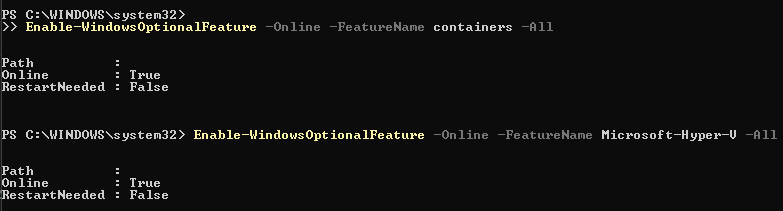

Step 2: Download the Docker Desktop installer
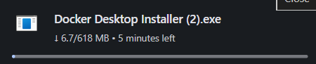

Step 3: Select the WSL 2 based engine option

Step 4: Note an engine switch error (context)
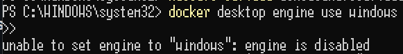

Step 5: Installer / engine snippet (context)
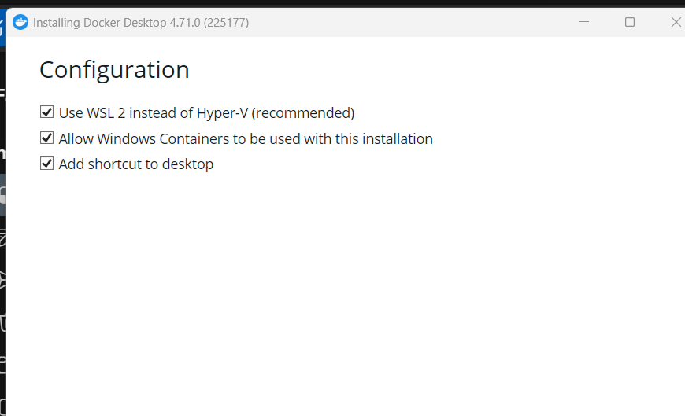

Step 6: Docker Desktop configuration during install
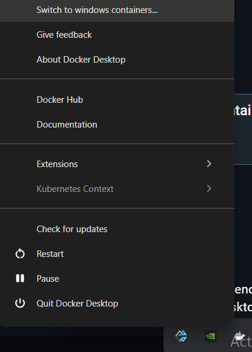

Step 7: Use the Docker Desktop menu to switch to Windows containers
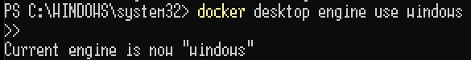

Step 8: Confirm current engine is now Windows
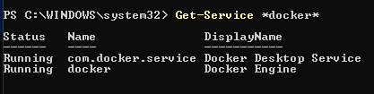

Step 9: Verify Docker services are running
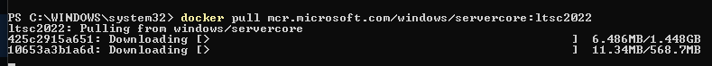

Step 10: Pull the Windows Server Core image
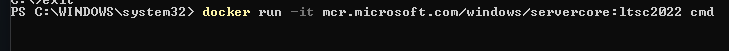

Step 11: Run an interactive Server Core container
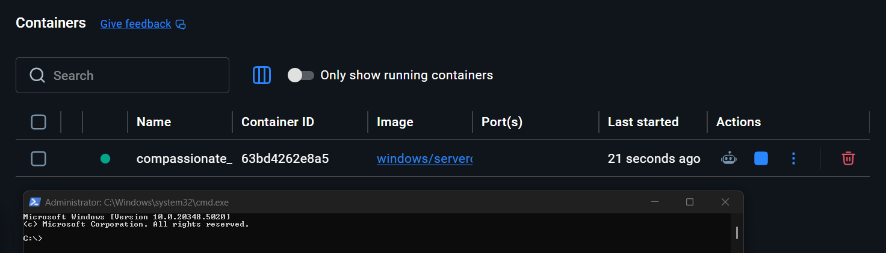

Step 12: See the running container in Docker Desktop
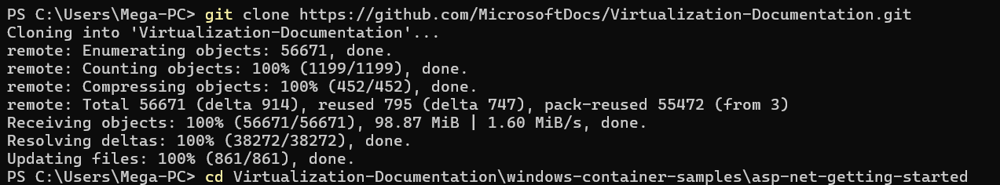

Step 13: Clone the sample Windows container repo
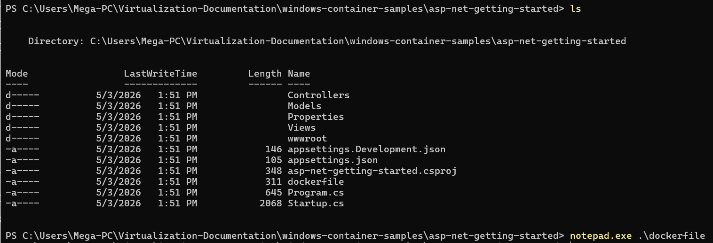

Step 14: List sample project files
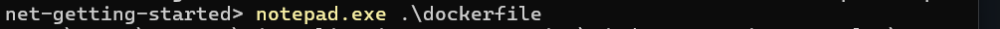

Step 15: Open the `dockerfile` (edit / review)
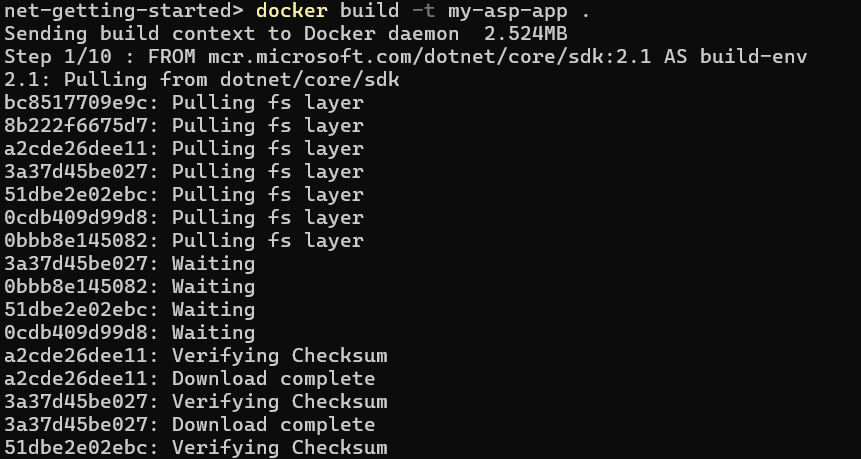

Step 16: Build the sample ASP.NET app image
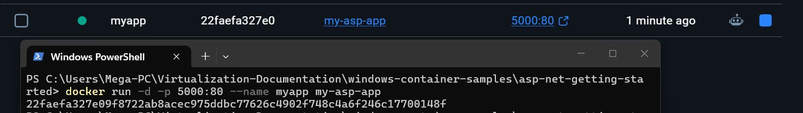

Step 17: Run the app container and verify at localhost:5000
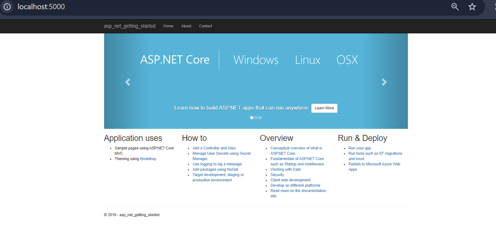

