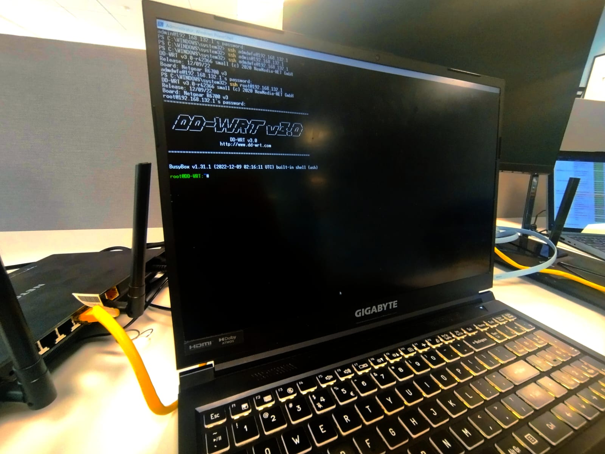

# Technical Deployment Report
## Patching a Netgear router with *DD-WRT* AND Deploying Tailscale on it.



### 1. Executive Overview

This is my complete deployment and troubleshooting process for converting a consumer router into a **Tailscale** gateway router running **DD-WRT**.

The router transparently forwards traffic from its LAN clients through a remote Tailscale exit node, allowing them to use the exit node’s public IP and/or access the remote LAN.

The deployment required solving several non-trivial networking problems including:
  - **Kernel** compatibility with userspace networking.
  - **NAT** interaction with overlay networks (SNAT and MASQUERADE).
  - **Linux bridge** behavior in router firmware.
- **Packet forwarding** through a virtual interface.
- **iptables** Firewall rules.
- **Persistence** on embedded systems.
- Startup **automation** via NVRAM hooks.

I learnt a lot during this project, so I hope you learn something too after reading this document.

### 2. System Architecture
#### Router:

Netgear R6700v3 \
Broadcom BCM4708 / BCM4709 \
RAM: ~256MB \ 
Flash: ~128MB 

#### Firmware:

DD-WRT v3.0 (2026 build) \
Linux kernel 4.4.302 \
BusyBox environment

#### Network topology:

```
LAN clients
   │
   │ WiFi / Ethernet
   │
Router (DD-WRT)
   │
   │ Tailscale tunnel
   │
Exit Node (Windows machine)
   │
Internet
```

#### Tailscale:
What is Tailscale? Here is a comprehensive mix of definitions (mine and other definitions):
-    *Tailscale* is a **mesh (Direct P2P) Overlay (on top of the already existing internet connection) VPN** service built on the WireGuard® protocol that creates a secure, private network between any devices, servers, or cloud environments, regardless of location. 

- Tailscale uses Carrier-Grade NAT space (100.64.0.0/10) internally.

### 3. Goal of the Deployment

The goal is to allow any device connected to the router to Browse the internet through a remote Tailscale exit node, without having to download the app.

==> This is useful especially for legace devices that cannot have the app.


### 4. Key Networking Concepts Used
4.1 Userspace Networking
Normally WireGuard uses kernel networking.
However DD-WRT's kernel may lack required modules.
Tailscale supports:
userspace networking
Meaning:
WireGuard engine runs inside userspace
instead of kernel

Interface created:
tailscale0

5.4 Linux Bridge
Routers often use bridges (virtual switch).

br0\
 ├─ eth1 (WiFi)\
 ├─ eth2 (WiFi)\
 └─ vlan1 (LAN ports)

So all devices connected to any of the interfeces (eth1, 2, and lan ports) appear in the same LAN.

5.5 NAT in This Deployment

Without NAT the exit node would receive packets from:
192.168.2.x

Those addresses are private.

Therefore the router performs:

MASQUERADE → source becomes router’s tailscale IP
5.6 Packet Flow (Important Concept)

Actual packet flow:

Client: 192.168.2.10
Destination: google.com

1. client → router
2. router NAT
3. router → tailscale0
4. encrypted via WireGuard
5. exit node decrypts
6. exit node sends to internet
6. Linux Routing Concepts

Routing table example:

default via 192.168.0.254 dev vlan2
192.168.2.0/24 dev br0

Meaning:

local LAN traffic → br0
internet traffic → WAN gateway

Tailscale modifies routing using policy routing.

7. Filesystem Constraints on Routers

DD-WRT uses several filesystems:

/tmp   RAM filesystem (temporary)
/jffs  flash storage (persistent)
/nvram configuration storage


9. Startup Automation

DD-WRT allows startup hooks stored in NVRAM.

Examples:

nvram set rc_startup="script"
nvram set rc_firewall="script"

These run during boot.

## Deployment Guide

This section describes the ideal deployment path.

-  Enable JFFS for persistance:
    * DD-WRT GUI → Management → JFFS2: Enable
- Download Tailscale:
```
mkdir -p /jffs/tailscale

wget https://pkgs.tailscale.com/stable/tailscale_1.60.0_arm.tgz

tar xzf tailscale_1.60.0_arm.tgz

cd tailscale_1.60.0_arm

chmod +x /jffs/tailscale/*
```
- Start daemon:
```
/jffs/tailscale/tailscaled --state=/jffs/tailscale/tailscale.state & 
```
- Connect to Tailscale, and authenticate through browser, which adds the device to the tailnet:
```
/jffs/tailscale/tailscale up --exit-node=100.64.186.77 --exit-node-allow-lan-access
```

- Enable interface to interface ip-forwarding:
```
echo 1 > /proc/sys/net/ipv4/ip_forward
OR
sysctl -w net.ipv4.ip_forward=1
```

- Set Allow rules in Iptables for forwarding from the br0 interface to the new tailscale0 interface.
```
iptables -A FORWARD -i br0 -o tailscale0 -j ACCEPT
iptables -A FORWARD -i tailscale0 -o br0 -m state --state RELATED,ESTABLISHED -j ACCEPT
```
 which **isn't enough**, because at this point, the packets are forwarded from *LAN* to *tailnet0* but with the LAN subnet, which is **unknown** to devices in the tailnet, so we need to:
- Configure NAT, but not the usual SNAT: `--to-source 100.64.0.5`, because that requires us to know the tailnet0 interface IP in the tailnet, which changes a lot, so you'd have to change the snat rule everytime you reset the connection to the tailnet, wheras **MASQUERADE** detects the interface IP automatically and NATs to it:
```
iptables -t nat -A POSTROUTING -o tailscale0 -j MASQUERADE
```
Now we have to make running Tailscale an the FW rules persistent, we use scripts containing the previous comands and tell `nvram` to run them on boot:
```
nvram set rc_startup="sh /jffs/tailscale-start.sh &"
nvram set rc_firewall="sh /jffs/tailscale-fw.sh"
nvram commit
```
- Reboot

After reboot verify:
```
tailscale status
```
Check routing:
```
ip route
```
Check NAT:
```
iptables -t nat -L
```
Check tailscale peers:
```
tailscale status
```

### The Reality-Check

This looks like *smooth sailing*, but trust me, it **WASN'T**;

Multiple issues were encounterd throughout the project, and **that's where the learning started actually happening**.

This it the **Layered Troubleshooting Methodology** I Used During Deployment: similar to the OSI Model.


Layer 1  Hardware\
Layer 2  Link / Bridge\
Layer 3  Routing\
Layer 4  NAT / Firewall\
Layer 5  Overlay Network\
Layer 6  Application

When connectivity failed, each layer was validated sequentially, for example:
```
LAN device → bridge → router forwarding → NAT → tailscale0 → exit node
```

### Encountered Issues:
1. **Router not supported by OpenWRT nor DD-WRT** in the official documentation:

So I used a modified compatible expressvpn firmware image built on top of dd-wrt, SSHd into it and upgraded the DD-WRT to a version that supports Tailscale.

2. **TUN Interface Crash**

I got this error when starting Tailscale the first time:
```
panic: runtime error: invalid memory address
wireguard-go tun_linux.go
Root Cause
```
The router kernel was:
```
Linux 4.4.302
```
Tailscale versions after 1.50 assume more modern kernel capabilities.
The crash occurred in:
```
wireguard-go TUN driver initialization
```
What Is a TUN Interface?

A TUN interface is a virtual network interface operating at Layer 3.

**Packets sent to tailscale0 interface are:**

captured by userspace\
processed by WireGuard\
encrypted\
sent to peers\
Why the Crash Happened

**DD-WRT kernels often:**

lack newer TUN ioctl implementations\
use older netlink APIs\
omit certain kernel modules\
The Tailscale engine expected features not present.

Diagnostic Commands

Check TUN device:

ls -l /dev/net/tun

Check module:

lsmod | grep tun

Final Resolution

The deployment switched to:

userspace networking

Instead of kernel WireGuard.

Meaning:

tailscaled handles networking internally

### Second Problem: SOCKS Proxy Failure

Initially a workaround was attempted:

tailscale SOCKS5 proxy

LAN clients would forward traffic through:

SOCKS5 → router → tailscale
Error Observed

Logs showed:

socks5: client connection failed: incompatible SOCKS version
Root Cause

Android WiFi proxy settings only support:

HTTP proxy

Not:

SOCKS5

Thus the proxy protocol negotiation failed.

Why SOCKS Was Abandoned

Even if SOCKS worked, it would require:

per-device configuration

The objective was:

transparent routing

Therefore NAT-based routing was implemented instead.

### Third Problem: WiFi Clients Had No Internet

This was the most complex issue.

Observed Behavior
Ethernet client → works
WiFi client → no connectivity
Key Diagnostic Commands

Bridge configuration:

brctl show

Output:

br0
 ├ eth1
 ├ eth2
 └ vlan1

Meaning:

WiFi and LAN ports share same bridge
Why This Was Confusing

Because both WiFi and Ethernet were in the same bridge:

traffic should behave identically

But packet counters showed:

iptables FORWARD rules = 0 packets

for WiFi interfaces.

Investigation

MAC table was checked:

brctl showmacs br0

This confirmed WiFi devices were visible.

Thus the issue was not Layer 2.

- NAT Misconfiguration

The key NAT rule originally used:

MASQUERADE -o tailscale0

But earlier rules also existed:

SNAT → vlan2

Meaning:

LAN traffic was still being NATed to WAN

instead of Tailscale.

Understanding NAT Priority

Linux NAT chains run in order.

If an earlier rule matches, later rules are never executed.

Therefore:

traffic exited through WAN

instead of Tailscale.

Correct Rule
iptables -t nat -A POSTROUTING -o tailscale0 -j MASQUERADE

- Linux Bridge Netfilter Interaction

A subtle issue encountered was:

bridge-nf-call-iptables
Why This Matters

Linux bridges normally operate at Layer 2.

Meaning packets do not pass through iptables.

To allow firewall rules on bridge traffic:

net.bridge.bridge-nf-call-iptables = 1

must be enabled.

Command Used
echo 1 > /proc/sys/net/bridge/bridge-nf-call-iptables

Without this setting:

WiFi traffic bypasses iptables

Which explains earlier failures.

- Routing Table Mistake

At one point the default route was changed to:

default dev tailscale0

This broke connectivity.

Why This Failed

The router itself must still reach:

WAN gateway
Tailscale DERP servers
control plane

If the default route is the tunnel:

bootstrap networking fails
Correct Design

Router routing table remains:

default via WAN

Only LAN client traffic is NATed to Tailscale.

- Understanding Tailscale Routing

Tailscale uses policy routing.

Example rule:

fwmark 0x80000 lookup table 52

Meaning:

packets marked by tailscale
use alternate routing table
Command to Inspect
ip rule

Example output:

5210: from all fwmark 0x80000 lookup main
- DERP Relays

In logs we saw:

magicsock: derp-23 connected
What DERP Is

DERP is a relay server used when peers cannot connect directly.

Example:

router → DERP → exit node

This is less efficient but ensures connectivity.

- DNS Resolver Errors

Logs contained:

resolver: forward: no upstream resolvers

This happens because:

DD-WRT DNS is handled by dnsmasq

Tailscale DNS manager does not modify router DNS.

This warning is harmless.

- Reboot Loop Issue

During early attempts the router entered reboot loops.

Cause

Startup script launched:

tailscale up

before:

network initialization completed
Fix

Added delay:

sleep 45

allowing:

WAN interface initialization
bridge creation
firewall loading
- Persistent Storage Problem

Initially binaries were stored in:

/tmp

But:

/tmp = RAM filesystem

Contents disappear after reboot.

Correct Location

Persistent storage:

/jffs

Used for:

binaries
state file
scripts
- State File Importance

The file:

tailscale.state

contains:

machine keys
node identity
login session

If lost, router must:

re-authenticate
- Understanding NVRAM

Routers use NVRAM to store configuration variables.

Example:

rc_startup
rc_firewall

Commands:

nvram set
nvram commit
- Final Stable Architecture

Final working design:

LAN clients
    ↓
br0 bridge
    ↓
iptables FORWARD
    ↓
NAT (MASQUERADE)
    ↓
tailscale0
    ↓
WireGuard encryption
    ↓
Exit node
    ↓
Internet

### Diagnostic Commands Cheat Sheet
Interface status
ip addr
Routing table
ip route
Bridge configuration
brctl show
Firewall rules
iptables -L
NAT rules
iptables -t nat -L
Tailscale peers
tailscale status
Packet counters
iptables -L -v
### Lessons Learned

New lessons from the deployment:

WiFi traffic may bypass firewall rules.

Persistence must be planned

Filesystems differ in embedded environments.

Packet counters are extremely valuable.

### Potential Improvements

Future enhancements could include:

Advertised routes

Allow Tailscale peers to reach LAN.

tailscale up --advertise-routes=192.168.2.0/24
High availability

Deploy multiple routers.

Traffic shaping

Apply QoS before tunnel.

Monitoring

Export router metrics.

## Conclusion

This project successfully transformed a consumer router into a Tailscale exit-node gateway.

The deployment required understanding:

Linux networking

router firmware architecture

overlay network routing

NAT interactions

bridge firewall behavior

embedded persistence mechanisms

The final system provides:

transparent VPN routing
for all LAN clients
without requiring client software
End of Report
